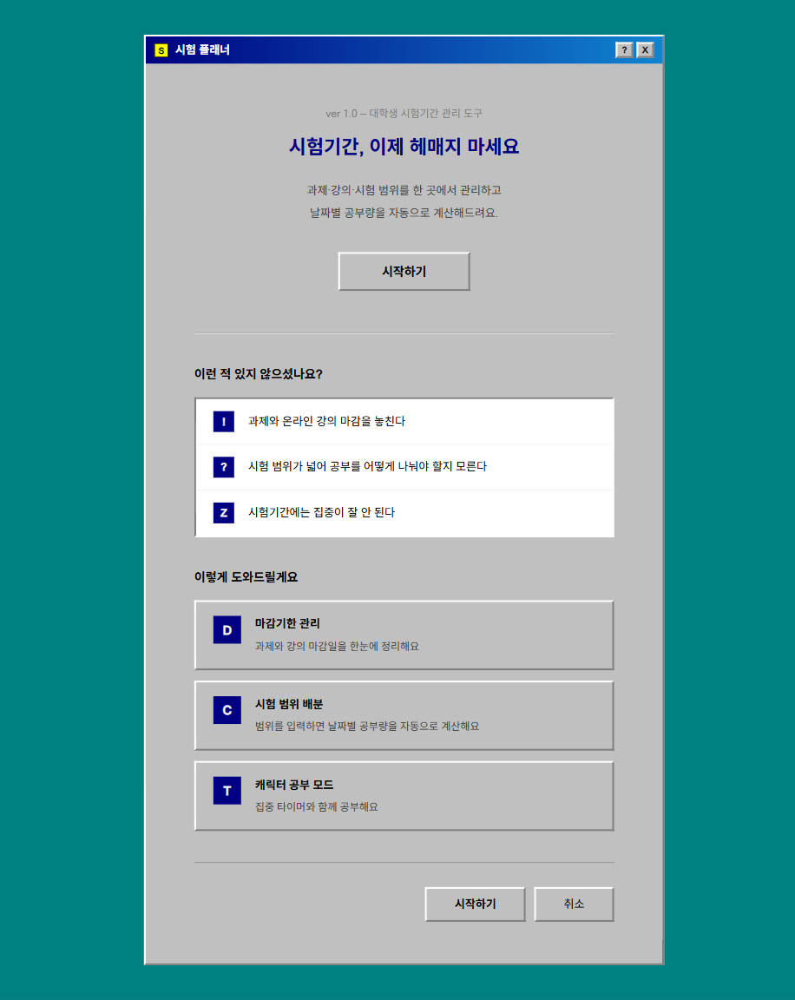
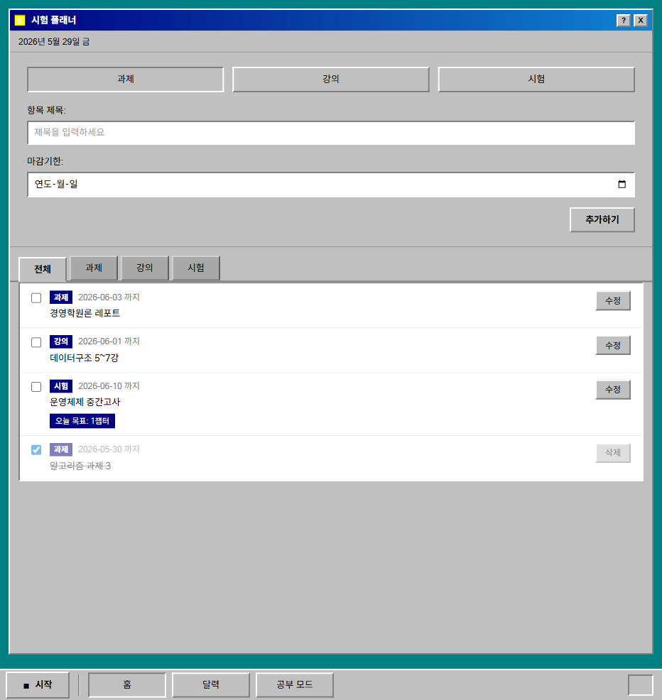
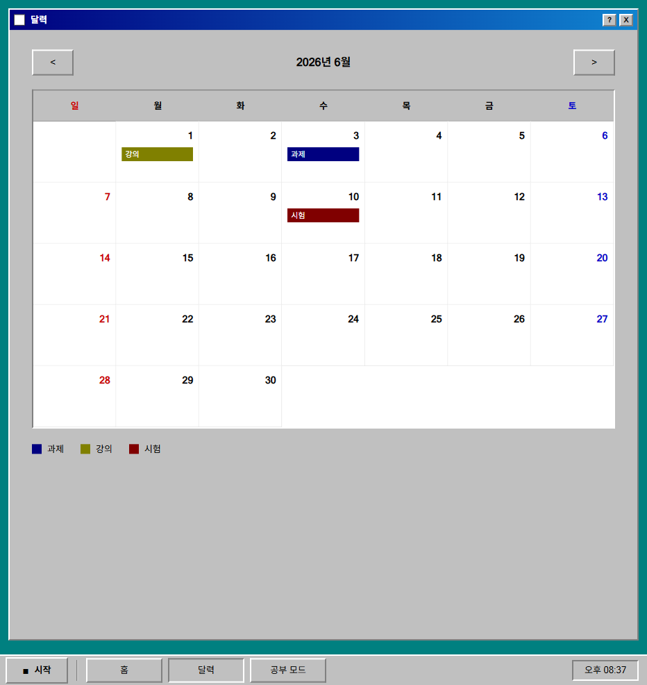
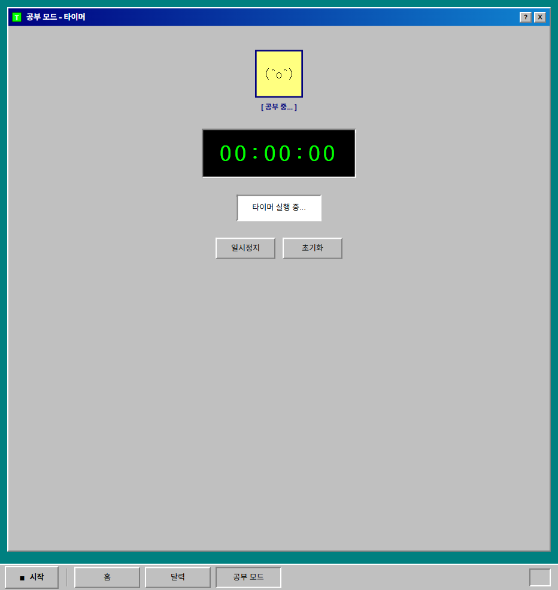

# 시험 플래너 — Study Planner MVP

대학생 시험기간 관리 서비스. 과제·강의·시험 마감기한을 한눈에 관리하고, 시험 범위를 날짜별로 자동 배분하며, 집중 타이머로 공부 시간을 기록합니다.

🌐 **배포 URL**: https://study-planner-mvp.vercel.app

---

## 화면 예시

| 온보딩 | 항목 관리 |
|---|---|
|  |  |

| 달력 뷰 | 집중 타이머 |
|---|---|
|  |  |

---

## 주요 기능

| 기능 | 설명 |
|---|---|
| 항목 등록 | 과제 / 강의 / 시험 유형별 등록, 마감기한 설정 |
| 자동 배분 | 시험 범위 → 오늘부터 마감일까지 하루 공부량 자동 계산 |
| 마감기한 순 정렬 | 등록한 항목을 마감기한 오름차순으로 자동 정렬 |
| 완료 토글 | 완료된 항목은 취소선 + 투명도로 표시 |
| 유형 필터 | 과제 / 강의 / 시험 탭으로 필터링 |
| 달력 뷰 | 월별 달력에서 마감일 한눈에 확인 |
| 집중 타이머 | 공부 시간 측정 (일시정지 / 초기화) |
| 로컬 저장 | localStorage 기반 — 새로고침해도 데이터 유지 |

---

## 로컬 실행

```bash
# 의존성 설치
pnpm install

# 개발 서버 실행 (http://localhost:3000)
pnpm dev

# 프로덕션 빌드
pnpm build

# E2E 테스트 (개발 서버 실행 상태에서)
npx playwright test
```

---

## 기술 스택

| 영역 | 기술 |
|---|---|
| Framework | Next.js 14 (App Router) |
| UI | React 18 |
| Language | TypeScript |
| Styling | Tailwind CSS + Win95 CSS |
| Storage | localStorage |
| Test | Playwright |

---

## 프로젝트 구조

```
src/
  app/
    page.tsx              # 랜딩 페이지 (/)
    app/
      page.tsx            # 메인 앱 (/app)
      calendar/page.tsx   # 달력 뷰 (/app/calendar)
      study/page.tsx      # 집중 타이머 (/app/study)
  features/
    items/                # 항목 CRUD (types, storage, useItems, components)
    study-mode/           # 타이머 컴포넌트
  lib/
    examSchedule.ts       # 시험 범위 자동 배분 알고리즘
```
